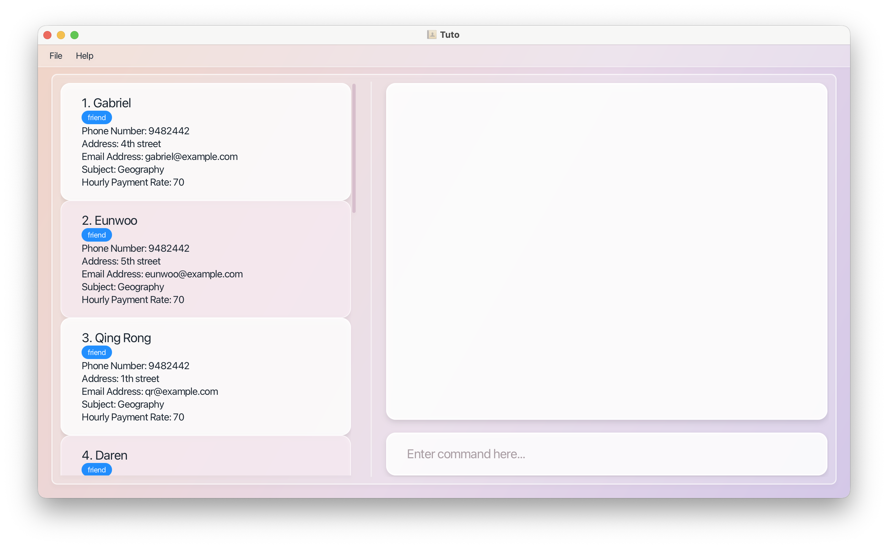

**Tuto** is a desktop address book application for **parents** who want to manage contacts of freelance tutors for their children. It allows you to easily store, organise, and look up tutor details — subjects taught, availability, rates, and more — so you can make informed decisions when choosing a tutor.

Tuto is **optimised for use via a Command Line Interface (CLI)** while still offering the benefits of a Graphical User Interface (GUI). If you can type fast, Tuto lets you manage tutor contacts faster than traditional GUI apps.

- For the detailed documentation of this project, see the **[Address Book Product Website](https://se-education.org/addressbook-level3)**.
- This project is a **part of the se-education.org** initiative. If you would like to contribute code to this project, see [se-education.org](https://se-education.org/#contributing-to-se-edu) for more info.